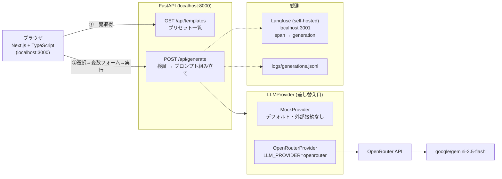

# preset-prompt-demo

プリセットプロンプト方式の非チャット型 LLM Web アプリの最小デモ。
「利用者はプロンプトを書かない。テンプレートを選び、変数を埋めるだけ」という構造を、
フルスタック（Next.js/TypeScript + FastAPI）で一晩で構築した学習ハンズオン（2026-07-14 実施）。

## アーキテクチャ



- **フロント**: テンプレートの `variables` 定義から入力フォームを動的生成。チャット欄は存在しない
- **バックエンド**: Pydantic スキーマで検証（利用者がプロンプトを書かない分、入力検証はサーバーの責任）
- **プロバイダ抽象化**: `LLM_PROVIDER` 環境変数で明示的に切り替え。デフォルトは mock なので、テストは外部 API に依存せず決定的に動く
- **観測 (Langfuse)**: 実行ごとに span（generate）→ generation（llm-call）の親子トレースを送信。プロンプト・出力・モデル・レイテンシを記録し、`template:xxx` / `provider:xxx` のタグで「どのプリセットの品質が悪いか」を後から絞り込める。 **評価・改善はトレースが残っていて初めて可能になる** ——これが LLM プロダクトの土台
- **観測基盤に依存しない設計**: Langfuse のキーが未設定なら計装は no-op になり、アプリは JSONL のローカルログだけで通常どおり動く。テストも外部 API・観測基盤を叩かない（`LLM_PROVIDER=mock` を強制）

## 使い方

```bash
# バックエンド
cd backend
uv sync
uv run pytest -v                          # 4テスト・外部接続なし
uv run uvicorn app.main:app --port 8000   # デフォルトは mock

# 実LLM（OpenRouter経由の Gemini）を使う場合: リポジトリ直下に .env を置く
#   OPENROUTER_API_KEY=sk-or-...
#   LLM_PROVIDER=openrouter

# フロントエンド（別ターミナル）
cd frontend
npm install
npm run dev   # → http://localhost:3000
```

### 観測基盤 (Langfuse セルフホスト)

```bash
cp .env.langfuse.example .env.langfuse
docker compose -f docker-compose.langfuse.yml --env-file .env.langfuse up -d
# → http://localhost:3001 （demo@example.com / localdemo1234。初期組織・プロジェクト・APIキーは自動作成）

# .env に3行追加して uvicorn を再起動すると、実行ごとにトレースが飛ぶ
#   LANGFUSE_PUBLIC_KEY=pk-lf-local-demo-0000
#   LANGFUSE_SECRET_KEY=sk-lf-local-demo-0000
#   LANGFUSE_HOST=http://localhost:3001
```

Langfuse web はホスト側 3001 で公開している（コンテナ内は 3000。Next.js のフロントと衝突するため変更）。

## 学習ログ（このハンズオンで踏んだ罠と学び）

- **pytest はカレントディレクトリを `sys.path` に入れない** → `pyproject.toml` の `pythonpath = ["."]` で解決
- **`.env` は書いただけでは読まれない** 。ただのファイルで、python-dotenv 等の「読み込み役」がいて初めて環境変数になる
- **環境変数はプロセス起動時に継承される** 。起動後に設定しても再起動するまで効かない
- FastAPI の型ヒント（Pydantic）は、Django なら手で書く JSON 検証を宣言だけで済ませる。壊れたリクエストはハンドラに届く前に 422 で弾かれる
- Next.js App Router は標準がサーバーコンポーネント。`useState` を使う画面には `"use client"` が要る
- TypeScript の型定義（`lib/types.ts`）はバックエンドの Pydantic スキーマと対になる「API 契約のクライアント側」
- **SDK のメジャーバージョン差でメソッド名が変わる**: Langfuse Python SDK は v4 で OpenTelemetry ベースになり、v3 の `start_as_current_span()` / `span.update_trace()` は廃止され、`start_as_current_observation(as_type=...)` / `propagate_attributes()` に置き換わった。記憶で書くと `AttributeError` で落ちる——AI エージェントに書かせるときは公式ドキュメント（Context7 等）を参照させるのが正しい作法
- **テストを外部依存から切り離す**: `.env` に `LLM_PROVIDER=openrouter` が入っていると pytest が実 API を叩いてしまう（実際に一度落ちた）。テスト冒頭で `LLM_PROVIDER=mock` を強制し、Langfuse キーも空にして決定的に動かす。テスト時間が 12.9秒 → 0.14秒 になった
- **Docker のポート衝突**: Langfuse web も Next.js も 3000 番を使う。compose のホスト側マッピングを 3001 に変更して回避
