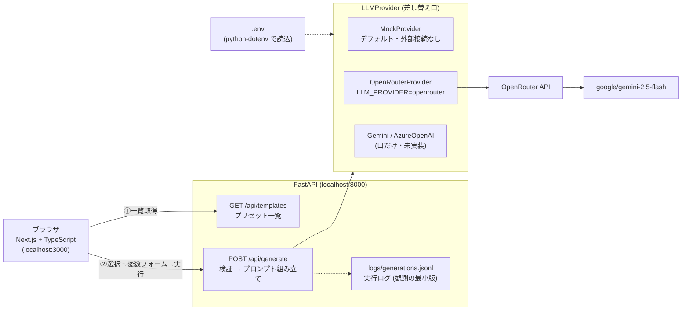

# preset-prompt-demo

プリセットプロンプト方式の非チャット型 LLM Web アプリの最小デモ。
「利用者はプロンプトを書かない。テンプレートを選び、変数を埋めるだけ」という構造を、
フルスタック（Next.js/TypeScript + FastAPI）で一晩で構築した学習ハンズオン（2026-07-14 実施）。

## アーキテクチャ



- **フロント**: テンプレートの `variables` 定義から入力フォームを動的生成。チャット欄は存在しない
- **バックエンド**: Pydantic スキーマで検証（利用者がプロンプトを書かない分、入力検証はサーバーの責任）
- **プロバイダ抽象化**: `LLM_PROVIDER` 環境変数で明示的に切り替え。デフォルトは mock なので、テストは外部 API に依存せず決定的に動く
- **観測ログ**: 実行ごとに JSONL でトレースを記録。本番なら Langfuse / LangSmith 等に流す層の最小版（評価・改善はログがあって初めて可能になる）

## 使い方

```bash
# バックエンド
cd backend
uv sync
uv run pytest -v                          # 4テスト・外部接続なし
uv run uvicorn app.main:app --port 8000   # デフォルトは mock

# 実LLM（OpenRouter経由の Gemini）を使う場合: リポジトリ直下に .env を置く
#   OPENROUTER_API_KEY=sk-or-...
#   LLM_PROVIDER=openrouter

# フロントエンド（別ターミナル）
cd frontend
npm install
npm run dev   # → http://localhost:3000
```

## 学習ログ（このハンズオンで踏んだ罠と学び）

- **pytest はカレントディレクトリを `sys.path` に入れない** → `pyproject.toml` の `pythonpath = ["."]` で解決
- **`.env` は書いただけでは読まれない** 。ただのファイルで、python-dotenv 等の「読み込み役」がいて初めて環境変数になる
- **環境変数はプロセス起動時に継承される** 。起動後に設定しても再起動するまで効かない
- FastAPI の型ヒント（Pydantic）は、Django なら手で書く JSON 検証を宣言だけで済ませる。壊れたリクエストはハンドラに届く前に 422 で弾かれる
- Next.js App Router は標準がサーバーコンポーネント。`useState` を使う画面には `"use client"` が要る
- TypeScript の型定義（`lib/types.ts`）はバックエンドの Pydantic スキーマと対になる「API 契約のクライアント側」
